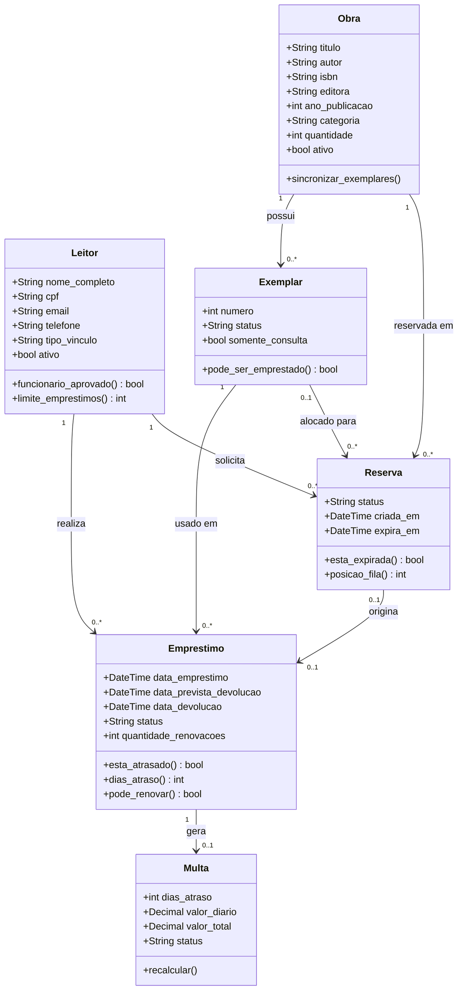

# Relatório do Sistema BiblioSys

## 1. Introdução

O BiblioSys é um sistema de gerenciamento de biblioteca implementado com Django, permitindo o controle de obras, leitores, empréstimos, reservas e multas.

## 2. Arquitetura e Estrutura

### 2.1 Visão Geral

O sistema foi arquitetado seguindo o padrão MVC (Model-View-Controller) do Django, com separação clara de responsabilidades entre models, views e templates.

### 2.2 Diagrama de Classes



## 3. Principais Modelos

### 3.1 Obra
- Representa um livro no acervo
- Possui múltiplos exemplares
- Controla quantidade disponível
- Campo `ativo` para soft delete

### 3.2 Leitor
- Usuário do sistema
- Pode ser aluno, professor, funcionário ou público externo
- Possui permissões baseadas em tipo de vinculação
- Limite de empréstimos baseado no tipo

### 3.3 Exemplar
- Cópia física de uma obra
- Rastreamento individual de status
- Número 1 é exclusivo para consulta local

### 3.4 Empréstimo
- Registro de empréstimos entre leitor e exemplar
- Controle de prazos e renovações
- Geração automática de multas para atrasos

### 3.5 Reserva
- Sistema de fila para obras emprestadas
- Notificação automática quando livro fica disponível
- Expiração de reserva se não retirada no prazo

### 3.6 Multa
- Cálculo automático baseado em dias de atraso
- Recalculável em função da configuração
- Estados: Pendente, Paga, Cancelada

## 4. Funcionalidades Principais

### 4.1 Gestão de Obras
- Cadastro, edição e exclusão (soft delete)
- Sincronização automática de exemplares
- Controle de quantidade

### 4.2 Gestão de Leitores
- Cadastro com validação de CPF e email
- Controle de tipo de vinculação
- Aprovação de solicitações para funcionário

### 4.3 Circulação de Livros
- Empréstimo com prazo automático
- Renovação com restrições
- Sistema de reservas com fila

### 4.4 Controle de Multas
- Cálculo automático por atraso
- Interface para quitação
- Histórico de transações

## 5. Testes

O sistema possui **53 testes unitários e de integração** cobrindo:
- Modelos (criação, validação, relacionamentos)
- Views (listagem, CRUD, permissões)
- Formulários (validação, processamento)
- Fluxos de negócio (empréstimos, reservas)

### 5.1 Cobertura de Testes

| Componente | Testes | Status |
|-----------|--------|--------|
| Models | 12 | ✅ Passando |
| Views de Listagem | 11 | ✅ Passando |
| CRUD de Formulários | 18 | ✅ Passando |
| Circulação | 9 | ✅ Passando |
| Perfil | 5 | ✅ Passando |
| Acesso | 3 | ✅ Passando |
| **Total** | **53** | **✅ OK** |

## 6. Configuração e Deploy

### 6.1 Requisitos
- Python 3.8+
- Django 3.2+
- SQLite (desenvolvimento)

### 6.2 Instalação
```bash
python -m venv .venv
source .venv/bin/activate
pip install -r requirements.txt
python manage.py migrate
python manage.py runserver
```

### 6.3 Executar Testes
```bash
python manage.py test biblioteca
```

## 7. Conclusão

O BiblioSys é um sistema completo e testado para gerenciamento de bibliotecas, com fluxos de trabalho bem definidos e validação rigorosa de dados.

---

**Última atualização:** 2026-06-28  
**Versão:** 1.0
